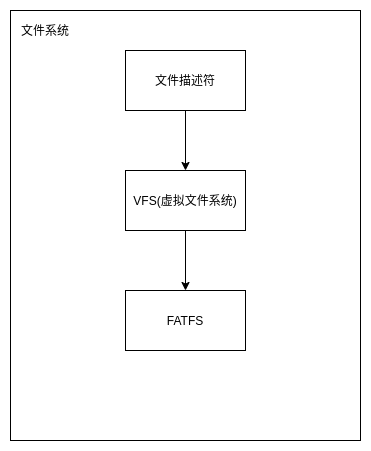

# 文件系统设计

## 文件系统架构图



## VFS(虚拟文件系统) 设计

### 数据结构定义

```c
// I节点内部数据
// 定义为联合体，节省空间的同时便于扩展
// fat32为fatfs所定义的文件对象
// fat32_dir为fatfs所定义的文件夹对象
typedef union{
    FIL fat32;
    DIR fat32_dir;
} InodeData;
// I节点：左孩子右兄弟
// data：I节点数据
// flag：文件定义和访问模式
// name：文件/文件夹名
// next：同一文件夹下的下一个I节点
// first_child：第一个字节点
typedef struct Inode{
    InodeData* data;
    int flag;
    char* name;
    struct Inode* next;
    struct Inode* first_child;
}Inode;
// 超级节点
// 用来存储全局信息和根I节点
typedef struct {
    struct Inode root_inode;
}Supernode;
```

### 接口定义

```c
// 初始化vfs
void vfs_init();
// 在vfs中从inode开始搜索path对应的路径
Inode* vfs_search(Inode *inode, char* path);
// 打开一个文件
Inode* vfs_open(char* path, int o_flag, int s_flag);
// 读文件
int vfs_read(Inode *inode,  char buf[], int count);
// 写文件
int vfs_write(Inode* inode, char buf[], int count);
// 关闭文件
void vfs_close(Inode* inode);
// 创建文件夹
Inode *vfs_mkdir(char* path, int flag);
// 根据路径删除i节点
int vfs_delete_inode(char* path);
```

## 文件描述符设计

### 数据结构定义

```c
// 文件描述符类型
// REDIRECT：该文件描述符应该重定向到其他文件描述符
// REGULAT：其他文件描述符
enum File_Describer_Type{
    FILE_DESCRIBER_REGULAR,
    FILE_DESCRIBER_REDIRECT
};
// 文件描述符访问控制
enum File_Access_Type{
    FILE_ACCESS_READ=1,
    FILE_ACCESS_WRITE=2,
};
// 文件描述符数据
// 每个文件描述符维护一个指向i节点的指针，如果该节点是重定向文件描述符则维护应该重定向到的文件描述符
typedef union{
    Inode *inode;
    int redirect_fd;
} File_Describer_Data;
// 文件描述符
// path：每个文件描述符维护该文件的全路径
typedef struct {
    enum File_Describer_Type fileDescriberType;
    enum File_Access_Type fileAccessType;
    File_Describer_Data data;
    char* path;
} File_Describer;

// 最大文件描述符个数
#define FILE_DESCRIBER_ARRAY_LENGTH 120

extern File_Describer file_describer_array[];
// 文件描述符引用计数
extern int file_describer_array_occupied[];
```

### 接口定义

```c
/**
 * 初始化VFS
 */
void init_file_describer();

/**
 * 在fd处初始化一个文件描述符
 * @param fd
 * @param fileDescriberType：文件描述符类型
 * @param fileAccessType：文件访问权限
 * @param data：数据
 * @param path：文件全路径
 */
void File_Describer_Create(
        int fd,
        enum File_Describer_Type fileDescriberType,
        enum File_Access_Type fileAccessType,
        File_Describer_Data data,
        char* path);

/**
 * fd引用计数加一
 * @param fd
 */
void File_Describer_Plus(int fd);

/**
 * fd引用计数减一
 * 如果fd是重定向文件描述符，那么包括此fd在内一直到源文件描述符的引用计数都会减一
 * 如果引用计数为0则释放该文件描述符
 * @param fd
 */
void File_Describer_Reduce(int fd);
```

### 简要描述

#### 引用计数

文件描述符是一个数组，每次需要分配文件描述符时分配一个引用计数为0的位置给新的fd并将其引用计数加一。

#### 复制文件描述符的规则

由于dup系统调用会复制文件描述符，但是在这一层每一个文件描述符都是唯一的，无法重复使用。

于是诞生了 REDIRECT，其做法是dup时仍然分配一个空闲fd，但是将其重定向到原来的fd，这样两个fd维护的数据便是同步的。

另外由于dup3系统调用会指定一个文件描述符作为新的描述符，这问题就更大了，所以每个进程都会维护一个虚拟文件描述符号映射，这样每个进程都享有全部的文件描述符号空间，只要在进入系统调用时将其转换为真实fd即可。

#### 关闭文件

关闭文件描述符时不会直接释放掉所有资源，只会将其引用计数减一，如果是REDIRECT文件描述符则会将其重定向链上的所有文件描述符引用计数都减一，当一个文件描述符的引用计数为0时才会释放资源。

